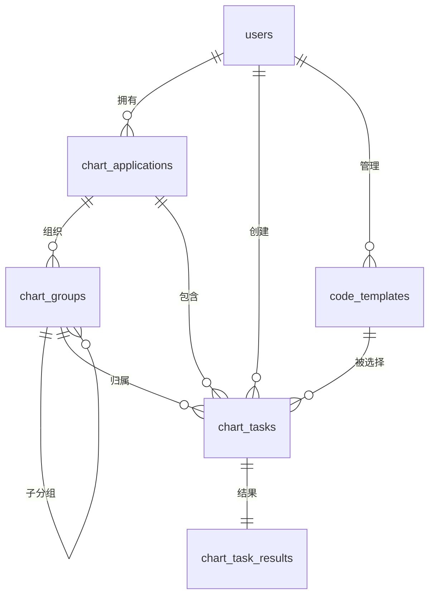

# 数据库结构说明

本文档列出了当前系统使用的核心数据表及字段说明，并提供最新的实体关系图（E-R 图），所有描述均为中文，便于快速了解数据模型。\
如需调整数据结构，请同步更新本文档。

## 表结构

### `users`
| 字段 | 类型 | 描述 |
| --- | --- | --- |
| `id` | INTEGER, PK | 用户主键 |
| `email` | VARCHAR(120) | 登录邮箱，唯一 |
| `username` | VARCHAR(80) | 用户名，唯一 |
| `password_hash` | VARCHAR(255) | 登录密码的加盐哈希值 |
| `created_at` | DATETIME | 注册时间 |

### `chart_applications`
| 字段 | 类型 | 描述 |
| --- | --- | --- |
| `id` | INTEGER, PK | 应用主键 |
| `name` | VARCHAR(120) | 应用名称，同一用户下唯一 |
| `user_id` | INTEGER, FK → `users.id` | 所属用户 |
| `created_at` | DATETIME | 创建时间 |
| `updated_at` | DATETIME | 最近更新时间 |
| `is_deleted` | BOOLEAN | 软删除标记，`TRUE` 表示已删除 |

### `chart_groups`
| 字段 | 类型 | 描述 |
| --- | --- | --- |
| `id` | INTEGER, PK | 分组主键 |
| `name` | VARCHAR(120) | 分组名称 |
| `app_id` | INTEGER, FK → `chart_applications.id` | 所属应用 |
| `parent_id` | INTEGER, FK → `chart_groups.id` | 上级分组，可空，实现目录层级 |
| `created_at` | DATETIME | 创建时间 |
| `updated_at` | DATETIME | 最近更新时间 |
| `is_deleted` | BOOLEAN | 软删除标记 |

### `chart_tasks`
| 字段 | 类型 | 描述 |
| --- | --- | --- |
| `id` | INTEGER, PK | 任务主键 |
| `title` | VARCHAR(255) | 任务名称 |
| `status` | VARCHAR(50) | 状态（`queued` / `processing` / `completed` / `failed` / `cancelled`）|
| `user_id` | INTEGER, FK → `users.id` | 创建任务的用户 |
| `app_id` | INTEGER, FK → `chart_applications.id` | 所属应用 |
| `group_id` | INTEGER, FK → `chart_groups.id` | 所属分组，可空 |
| `image_path` | VARCHAR(500) | 上传图片的存储路径 |
| `template_id` | INTEGER, FK → `code_templates.id` | 选用的代码模板，可空 |
| `created_at` | DATETIME | 创建时间 |
| `updated_at` | DATETIME | 最近更新时间 |
| `is_deleted` | BOOLEAN | 软删除标记 |

### `chart_task_results`
| 字段 | 类型 | 描述 |
| --- | --- | --- |
| `id` | INTEGER, PK | 任务结果主键 |
| `task_id` | INTEGER, FK → `chart_tasks.id`，UNIQUE | 对应的任务 |
| `is_success` | BOOLEAN | 是否处理成功 |
| `summary` | TEXT | 图表摘要 |
| `table_data` | JSON | 图表转表格后的结构化数据 |
| `data_points` | JSON | 数据点明细（包含每个点的描述）|
| `error_message` | TEXT | 若失败则记录失败原因 |

### `code_templates`
| 字段 | 类型 | 描述 |
| --- | --- | --- |
| `id` | INTEGER, PK | 模板主键 |
| `name` | VARCHAR(120) | 模板名称 |
| `language` | VARCHAR(20) | 模板语言，仅支持 `java` / `kotlin` |
| `content` | TEXT | 模板内容 |
| `is_system` | BOOLEAN | 是否为系统内置模板 |
| `user_id` | INTEGER, FK → `users.id` | 所属用户，系统模板为空 |
| `created_at` | DATETIME | 创建时间 |
| `updated_at` | DATETIME | 最近更新时间 |
| `is_deleted` | BOOLEAN | 软删除标记 |

## E-R 图

以上结构覆盖了用户、应用、分组、任务、模板以及任务结果之间的核心关系，可作为设计与开发的参考依据。
