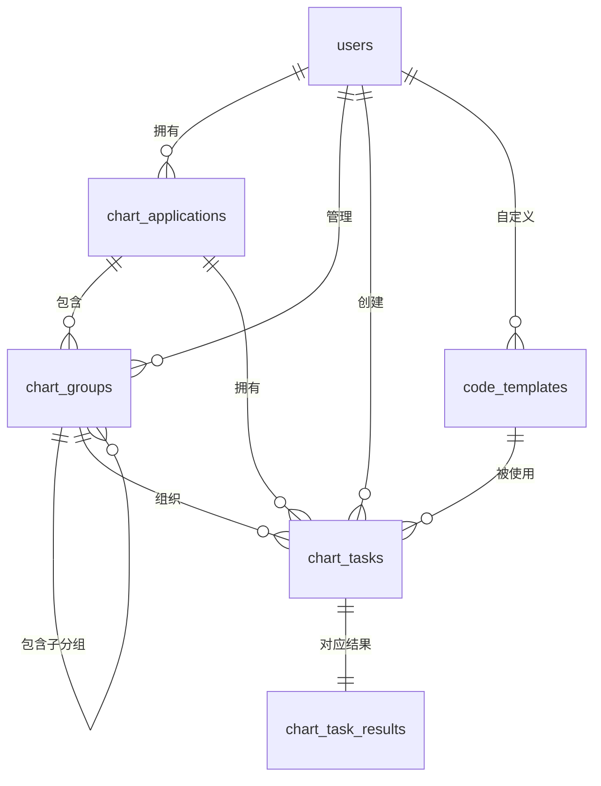

# 数据库结构说明

本文档概述了无障碍图表系统当前使用的主要数据表及字段含义，并以 E-R 图展示它们之间的关系。

## 表结构

### `users`
| 字段 | 类型 | 描述 |
| --- | --- | --- |
| `id` | INTEGER, PK | 用户唯一标识 |
| `email` | VARCHAR(120) | 登录邮箱，唯一 |
| `username` | VARCHAR(80) | 用户名，唯一 |
| `name` | VARCHAR(120) | 显示名称 |
| `password_hash` | VARCHAR(255) | 登录密码的哈希值 |
| `created_at` | DATETIME | 注册时间 |

### `chart_applications`
| 字段 | 类型 | 描述 |
| --- | --- | --- |
| `id` | INTEGER, PK | 应用唯一标识 |
| `name` | VARCHAR(120) | 应用名称，同一用户下唯一 |
| `user_id` | INTEGER, FK → `users.id` | 所属用户 |
| `created_at` | DATETIME | 创建时间 |

### `chart_groups`
| 字段 | 类型 | 描述 |
| --- | --- | --- |
| `id` | INTEGER, PK | 分组唯一标识 |
| `name` | VARCHAR(120) | 分组名称 |
| `user_id` | INTEGER, FK → `users.id` | 所属用户 |
| `application_id` | INTEGER, FK → `chart_applications.id` | 所属应用 |
| `parent_id` | INTEGER, FK → `chart_groups.id` | 父分组，可为空，用于目录结构 |
| `created_at` | DATETIME | 创建时间 |

### `chart_tasks`
| 字段 | 类型 | 描述 |
| --- | --- | --- |
| `id` | INTEGER, PK | 任务唯一标识 |
| `title` | VARCHAR(255) | 任务标题 |
| `status` | VARCHAR(50) | 当前状态（pending/processing/completed/failed/cancelled） |
| `language` | VARCHAR(20) | 任务偏好的代码语言 |
| `user_id` | INTEGER, FK → `users.id` | 发起用户 |
| `application_id` | INTEGER, FK → `chart_applications.id` | 所属应用 |
| `group_id` | INTEGER, FK → `chart_groups.id` | 所属分组，可为空 |
| `image_path` | VARCHAR(500) | 原始图表文件相对路径 |
| `template_id` | INTEGER, FK → `code_templates.id` | 生成时选用的模板，可为空 |
| `created_at` | DATETIME | 创建时间 |
| `updated_at` | DATETIME | 最近更新时间 |

### `chart_task_results`
| 字段 | 类型 | 描述 |
| --- | --- | --- |
| `id` | INTEGER, PK | 结果记录唯一标识 |
| `task_id` | INTEGER, FK → `chart_tasks.id`，UNIQUE | 对应的任务 |
| `is_success` | BOOLEAN | 是否生成成功 |
| `summary` | TEXT | 图表摘要 |
| `description` | TEXT | 数据点文本描述 |
| `data_points` | JSON | 数据点集合 |
| `table_data` | JSON | 图表转表格后的结构化数据 |
| `generated_code` | TEXT | 当前展示的代码片段 |
| `java_code` | TEXT | Java 原始代码 |
| `kotlin_code` | TEXT | Kotlin 原始代码 |
| `integration_doc` | JSON | 集成说明（按语言划分步骤） |
| `custom_code` | TEXT | 用户保存的自定义代码（JSON 字符串） |
| `error_message` | TEXT | 失败原因描述 |
| `created_at` | DATETIME | 结果创建时间 |
| `updated_at` | DATETIME | 最近更新时间 |

### `code_templates`
| 字段 | 类型 | 描述 |
| --- | --- | --- |
| `id` | INTEGER, PK | 模板唯一标识 |
| `name` | VARCHAR(120) | 模板名称 |
| `language` | VARCHAR(20) | 模板语言（java/kotlin） |
| `content` | TEXT | 模板内容 |
| `is_system` | BOOLEAN | 是否为系统默认模板 |
| `user_id` | INTEGER, FK → `users.id` | 自定义模板所属用户，可为空 |
| `created_at` | DATETIME | 创建时间 |
| `updated_at` | DATETIME | 最近更新时间 |

## E-R 图

以上信息可帮助开发者快速理解数据库结构及各实体之间的联系。
